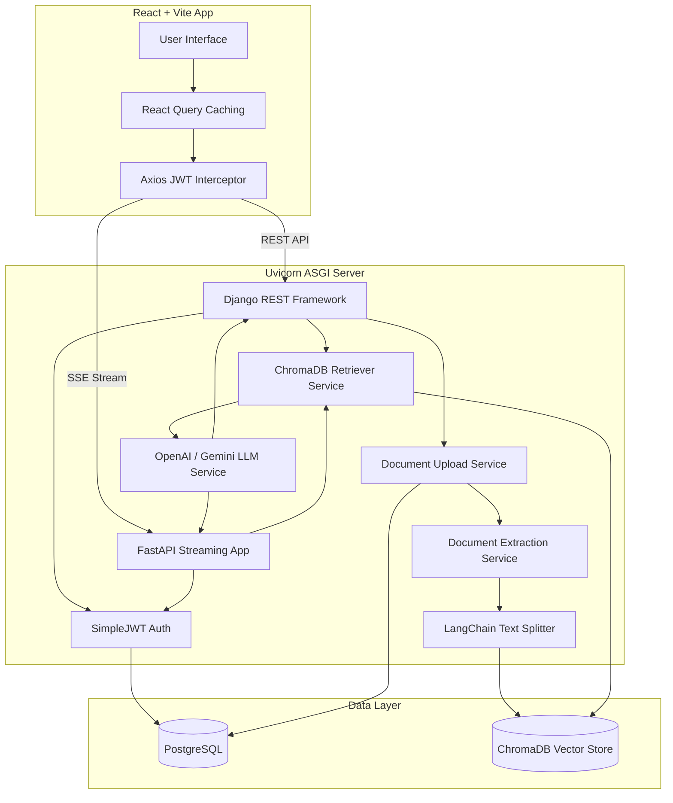

# DocuMind AI

DocuMind AI is a state-of-the-art **Retrieval-Augmented Generation (RAG)** document intelligence assistant. It empowers users to securely upload documents, organize them into collections, and interact with them using natural language queries.

By orchestrating document processing, semantic search via embeddings, Vector Databases, and Large Language Models (LLMs), DocuMind AI generates highly accurate answers grounded entirely in user-provided context—complete with precise source citations.

---

## 🏗 Architecture Diagram



---

## ✨ Core Features

- **Multi-Format Processing**: Effortlessly ingest `.pdf`, `.docx`, and `.txt` documents.
- **Semantic Vector Search**: Automatically generates `all-MiniLM-L6-v2` embeddings for semantic similarity retrieval.
- **Real-Time AI Streaming**: Experience token-by-token ChatGPT-like responses powered by Server-Sent Events (SSE) and FastAPI.
- **RAG Generation**: Asks intelligent questions and receives AI-generated answers grounded *strictly* in your documents.
- **Precise Citations & Highlights**: Every AI response includes direct citations tracking the document source, page number, AI relevance score, and the exact highlighted passage used to generate the answer. Clicking a citation instantly navigates the user to the precise location.
- **Retrieval Debug Mode**: Developers can append `debug=true` to query payloads to introspect the full RAG pipeline. It exposes the exact LLM prompt, token usage, embedding dimensions, latencies, and similarity scores without altering the generated answer. It can be safely toggled globally in production via the `ENABLE_DEBUG_MODE` environment variable.
- **Document Collections**: Organize your workspaces (e.g., "Machine Learning Notes").
- **Strict Tenant Isolation**: Robust Django ORM restrictions ensure users can *never* query or access documents owned by other users.
- **Conversational Memory**: Chat sessions remember the last 5 turns of history for seamless conversation flow.
- **Secure Authentication**: Protected via JWT Access/Refresh tokens.

---

## 🛠 Technology Stack

### Frontend
- **React 18** with **TypeScript** & **Vite**
- **Tailwind CSS v3** (Custom Glassmorphism & Micro-animations)
- **React Query (@tanstack/react-query)** for server state
- **React Router v6**

### Backend
- **Python 3.11** 
- **Django 5 & Django REST Framework (DRF)** for core API logic
- **FastAPI & Uvicorn (ASGI)** for asynchronous SSE streaming
- **PyMuPDF** & **python-docx** for rapid document extraction

### Artificial Intelligence & Database
- **LangChain** (RAG Orchestration, Text Splitting)
- **Sentence Transformers** (Embeddings)
- **OpenAI API** / **Google Gemini API** (LLMs)
- **ChromaDB** (Vector Store)
- **PostgreSQL** (Relational Metadata & Auth Storage)

---

## 🚀 Setup & Installation (Docker)

The easiest way to run DocuMind AI locally is via Docker Compose.

### Prerequisites
- Docker & Docker Compose
- An OpenAI API Key

### Steps

1. **Clone the repository**:
   ```bash
   git clone https://github.com/satvikvatsa196-hash/DocuMind-AI.git
   cd DocuMind-AI
   ```

2. **Configure Environment Variables**:
   Create a `.env` file in the root directory:
   ```env
   OPENAI_API_KEY=sk-your-openai-key-here
   ```

3. **Spin up the stack**:
   ```bash
   docker-compose up --build -d
   ```

4. **Access the Application**:
   - **Frontend UI**: `http://localhost:5173`
   - **Backend API Docs (Swagger)**: `http://localhost:8000/api/docs/`
   - **ChromaDB**: `http://localhost:8001`

---

## 📚 API Overview (Swagger UI)

DocuMind AI ships with auto-generated OpenAPI documentation using `drf-spectacular`. 
Once running, visit `http://localhost:8000/api/docs/` to interactively test endpoints:

- `POST /api/users/login/` - Obtain JWT tokens
- `POST /api/documents/upload/` - Upload PDF/DOCX
- `POST /api/chat/query/` - Execute a RAG query (Standard)
- `POST /api/chat/fastapi/stream/` - Execute a RAG query using Server-Sent Events (SSE) for token-by-token streaming

### Example RAG Request
```json
{
  "query": "What are the core concepts of Machine Learning?",
  "collection_id": 2,
  "session_id": 5
}
```

### Example RAG Response
```json
{
  "answer": "Machine Learning core concepts include Supervised Learning, Unsupervised Learning, and Reinforcement Learning.",
  "citations": [
    {
      "document_name": "ML_Notes.pdf",
      "page_number": "4",
      "chunk_id": "doc_1_chunk_4_abc123"
    }
  ],
  "retrieved_passages": [
    {
      "document_name": "ML_Notes.pdf",
      "page_number": "4",
      "chunk_id": "doc_1_chunk_4_abc123",
      "chunk_text": "Machine Learning core concepts include Supervised Learning, Unsupervised Learning, and Reinforcement Learning...",
      "relevance_score": 0.94
    }
  ]
}
```

### Example RAG Request with Debug Mode
```json
{
  "query": "What are the core concepts of Machine Learning?",
  "collection_id": 2,
  "debug": true
}
```

### Example Debug Output Payload
When `debug=true` is provided (and enabled globally), the API response includes a rich `debug` object alongside the standard answer and citations:
```json
{
  "answer": "Machine Learning core concepts include Supervised Learning...",
  "citations": [...],
  "retrieved_passages": [...],
  "debug": {
    "original_user_question": "What are the core concepts of Machine Learning?",
    "generated_embedding_dimension": 384,
    "retrieval_query": "What are the core concepts of Machine Learning?",
    "retrieved_chunks": ["Machine Learning core concepts include Supervised Learning..."],
    "similarity_scores": [0.94],
    "chunk_ids": ["doc_1_chunk_4_abc123"],
    "document_names": ["ML_Notes.pdf"],
    "prompt_sent": "SYSTEM:\nYou are a helpful AI document assistant...\n\nUSER:\nContext:\n--- Context Chunk 1... ---",
    "token_count": {
      "input_tokens": 125,
      "output_tokens": 18,
      "total_tokens": 143
    },
    "response_generation_time": "1.2345s",
    "retrieval_latency": "0.1234s",
    "total_latency": "1.3579s"
  }
}
```

---

## 🧗 Challenges Faced & Solutions

1. **Vector Database Tenant Isolation**
   - *Challenge*: ChromaDB does not inherently understand User roles. A bad actor could potentially query another user's vector embeddings.
   - *Solution*: Built a strict security layer in Django that intercepts every RAG query, fetches a whitelist of PostgreSQL `document_id`s owned by the authenticated user, and binds the Vector Search securely within those boundaries.
2. **Context Window Limitations**
   - *Challenge*: Feeding massive PDFs directly into the LLM exceeds token limits and causes hallucinations.
   - *Solution*: Implemented LangChain's `RecursiveCharacterTextSplitter` to dynamically chunk documents into 1000-character blocks with a 200-character overlap, ensuring sentences aren't cleanly severed.
3. **Synchronous Django vs Real-Time Streaming**
   - *Challenge*: Django's WSGI and standard DRF views cannot natively stream asynchronous tokens dynamically without complex workarounds or Daphne.
   - *Solution*: Mounted a dedicated **FastAPI** application directly alongside Django within a combined **Uvicorn ASGI** server. Leveraged `sync_to_async` to securely connect FastAPI's asynchronous streaming generators with Django's synchronous ORM.

---

## 🔮 Future Improvements

- **Celery / Redis Queues**: Offload document extraction and embedding generation to asynchronous distributed task queues for massive scalability.
- **Advanced Chunking**: Implement semantic chunking instead of naive character chunking.
- **GraphRAG**: Integrate knowledge graphs to understand complex relationships across disparate documents.
